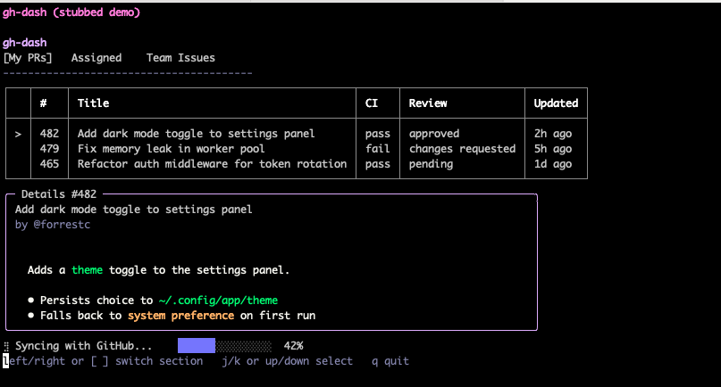

# StreamWeaverCharm

**Write terminal UIs the way you'd write a web view - a Ruby block that re-executes on every interaction. No manual redraws, no state synchronization, no Elm Architecture boilerplate to hand-roll.**

StreamWeaverCharm brings [StreamWeaver](https://github.com/fkchang/stream_weaver)'s reactive model - already proven for web UIs - to the terminal, on top of Charm's [Bubbletea](https://github.com/charmbracelet/bubbletea) (Go's most popular TUI framework, via its official Ruby bindings). If you already know StreamWeaver, you already know StreamWeaverCharm - same mental model, different target.

Under the hood it combines real, independently-published Charm-Ruby gems where they exist - [bubbletea](https://github.com/marcoroth/bubbletea-ruby) for the event loop, [bubbles](https://github.com/marcoroth/bubbles-ruby) for spinner/progress, [glamour](https://github.com/marcoroth/glamour-ruby) for markdown, [lipgloss](https://github.com/marcoroth/lipgloss-ruby) transitively - with a lightweight raw-ANSI styling layer for everything else.



The screen above is [`examples/components/gh_dash_demo.rb`](examples/components/gh_dash_demo.rb) - fake data, styled after the real [gh-dash](https://github.com/dlvhdr/gh-dash) (itself built on bubbletea/lipgloss/glamour) - in full:

```ruby
tui "gh-dash (stubbed demo)", theme: :dracula do
  # ...tabs, fake PR/issue data...

  table headers: ["", *section[:headers]], rows: table_rows

  box title: "Details ##{row[:number]}" do
    text row[:title]
    markdown row[:body]
  end

  hstack(spacing: 4) do
    spinner :sync, label: "Syncing with GitHub..."
    progress :sync_progress, value: 42, max: 100, width: 20
  end
end.run!(alt_screen: true)
```

## Installation

```ruby
gem 'stream_weaver_charm'
```

Or install directly:

```bash
gem install stream_weaver_charm
```

**Requirements:** Ruby 3.2+

## Quick Start

```ruby
require 'stream_weaver_charm'

tui "Counter" do
  state[:count] ||= 0

  box title: "Simple Counter" do
    text "Count: #{state[:count]}"
  end

  help_text "[+/-] change  [q] quit"

  on_key "+" do |s|
    s[:count] += 1
  end

  on_key "-" do |s|
    s[:count] -= 1
  end
end.run!
```

Run: `ruby counter.rb`

## The Key Insight

**Your Ruby block re-executes on every key press.**

Press `+`:
1. The `on_key "+"` callback runs: `s[:count] += 1`
2. The entire block re-executes with updated state
3. The TUI re-renders showing the new count

No manual screen updates. No state synchronization. Just Ruby.

## Components

### Display

```ruby
text "Plain text"
text "Dimmed", style: :dim
text "Success!", style: :success

header1 "Big Title"
header "Section"      # h2
header3 "Subsection"

divider              # ────────────
```

### Layout

```ruby
vstack spacing: 1 do
  text "Vertical"
  text "Stack"
end

hstack spacing: 2 do
  text "Side"
  text "by"
  text "Side"
end

box title: "Card" do
  text "Content inside a bordered box"
end
```

### Alerts

```ruby
alert variant: :info do
  text "Information"
end

alert variant: :success do
  text "It worked!"
end

alert variant: :warning do
  text "Be careful"
end

alert variant: :error do
  text "Something went wrong"
end
```

### Key Bindings

```ruby
on_key "+" do |s|
  s[:count] += 1
end

on_key "enter" do |s|
  s[:submitted] = true
end

on_key "ctrl+s" do |s|
  # Save
end

# Default quit keys: q, ctrl+c
# Customize with:
quit_on "q", "esc"
```

### Input Components

```ruby
# Single-line text input
text_input :name, placeholder: "Your name", label: "Name"
text_input :email, placeholder: "Email address"

# Multi-line text area
text_area :bio, placeholder: "Tell us about yourself", rows: 4, label: "Bio"

# Access values via state
text "Hello, #{state[:name]}!" if state[:name]
```

**Focus management:** Tab cycles between inputs, Shift+Tab goes backward. First input auto-focuses.

### Buttons (Mouse Support)

```ruby
tui "App" do
  button "Save" do |s|
    s[:saved] = true
  end

  button "Cancel" do |s|
    s[:cancelled] = true
  end
end.run!(mouse: true)  # Enable mouse support
```

Buttons render as `[Label]` and respond to mouse clicks.

### Selection Components

```ruby
# Scrollable list with j/k navigation
list :selected_file, ["app.rb", "Gemfile", "README.md"], height: 5

# Single-select (radio buttons)
select :priority, ["Low", "Medium", "High"]

# Table from array of hashes
table [
  { name: "Alice", role: "Admin" },
  { name: "Bob", role: "User" }
], striped: true

# Or with explicit headers/rows
table headers: ["Name", "Size"], rows: [
  ["app.rb", "4kb"],
  ["Gemfile", "1kb"]
]
```

### Loading & Progress (via the `bubbles` gem)

```ruby
spinner :loading, label: "Fetching updates..."

progress :download, value: 45, max: 100, width: 20
# Renders: ████████░░░░░░░░  45%
```

`spinner` animates on its own (tick-driven, no polling required) - even if it's created conditionally partway through a run, not just present from the first render. `progress` is a static render of whatever `value`/`max` you pass, redrawn each time your block re-executes.

### Rich Text (via the `glamour` gem)

```ruby
markdown <<~MD
  # Release Notes

  - Added **dark mode**
  - Fixed the `flicker` bug
MD
```

Renders real markdown - headings, emphasis, lists, code - as ANSI-styled terminal output, theme-aware (matches your `theme:` where Glamour has a preset, falls back to its `auto` style otherwise).

### Help Text

```ruby
help_text "j/k: move | space: toggle | q: quit"
```

## Agentic Mode (`run_once!`)

One-shot forms that return data to the caller - perfect for CLI tools and agent integrations:

```ruby
result = tui "Quick Input" do
  text_input :name, placeholder: "Your name"
  text_input :email, placeholder: "Email"

  submit_on "ctrl+s"  # Keys that submit the form
end.run_once!

if result
  puts "Name: #{result[:name]}, Email: #{result[:email]}"
else
  puts "Cancelled"
end
```

- `run_once!` returns the state hash on submit, `nil` on cancel (Ctrl+C)
- `submit_on` defines which keys trigger form submission

## State

State is a hash. Access with `state[:key]`:

```ruby
tui "Example" do
  state[:name] ||= "World"
  state[:items] ||= []

  text "Hello, #{state[:name]}!"
  text "Items: #{state[:items].join(', ')}"
end
```

## Examples

### Todo List

```ruby
tui "Todo" do
  state[:todos] ||= [
    { text: "Learn StreamWeaverCharm", done: false },
    { text: "Build something cool", done: false }
  ]
  state[:selected] ||= 0

  header1 "My Tasks"
  divider

  state[:todos].each_with_index do |todo, i|
    prefix = state[:selected] == i ? ">" : " "
    check = todo[:done] ? "[x]" : "[ ]"
    style = todo[:done] ? :dim : nil
    text "#{prefix} #{check} #{todo[:text]}", style: style
  end

  divider
  help_text "j/k: move | space: toggle | q: quit"

  on_key "j" do |s|
    s[:selected] = [s[:selected] + 1, s[:todos].size - 1].min
  end

  on_key "k" do |s|
    s[:selected] = [s[:selected] - 1, 0].max
  end

  on_key "space" do |s|
    s[:todos][s[:selected]][:done] ^= true
  end
end.run!
```

### More Examples

The [`examples/`](examples/) directory has 20+ runnable scripts, organized by topic (`basic/`, `components/`, `agentic/`, `bash/`) - see [`examples/README.md`](examples/README.md) for the full index. Worth starting with:

- [`examples/components/gh_dash_demo.rb`](examples/components/gh_dash_demo.rb) - a stubbed dashboard styled after the real [gh-dash](https://github.com/dlvhdr/gh-dash) (itself built on bubbletea/lipgloss/glamour), exercising most of this library's components in one screen: tabs, a table, a detail panel with markdown, a spinner, and a progress bar. `ruby examples/components/gh_dash_demo.rb light` if your terminal has a light background.
- [`examples/components/form.rb`](examples/components/form.rb) - text inputs with Tab-cycling focus
- [`examples/agentic/quick_input.rb`](examples/agentic/quick_input.rb) - `run_once!` in practice

## Architecture

StreamWeaverCharm wraps Charm's [Bubbletea](https://github.com/charmbracelet/bubbletea) (the Elm Architecture for TUIs):

- **Model**: Your `state` hash
- **Update**: Key handlers (`on_key`) modify state
- **View**: Your DSL block renders the UI

The block re-executes on every `view()` call, just like StreamWeaver re-renders on every HTTP request.

## Theming

Apply built-in themes or create custom ones:

```ruby
# Built-in themes: :default, :dracula, :nord, :monokai, :light
# (:light is for light-background terminals - the others assume dark)
tui "App", theme: :dracula do
  header1 "Dracula styled!"
end.run!

# Custom theme
tui "App", theme: {
  title: { fg: "#FF6B6B", bold: true },
  header1: { fg: "#74B9FF", bold: true }
} do
  # ...
end.run!

# Custom inline styles
tui "App" do
  style :highlight, fg: :cyan, bold: true
  style :muted, fg: :gray, dim: true

  text "Important!", style: :highlight
  text "Less important", style: :muted

  # Or inline hash
  text "Custom", style: { fg: "#FF79C6", italic: true }
end.run!
```

## Style System

Display and layout components (`text`, `header1/2/3`, `box`, `alert`, `table`) use raw ANSI escape codes directly, not Lipgloss - simpler for the common case, and it sidesteps a real Go-runtime segfault Lipgloss used to hit under repeated `Style` creation on some platforms (fixed upstream as of `lipgloss` 0.2.2, which `spinner`/`progress` now depend on transitively). Built-in styles:

- `:dim` - Muted gray text
- `:help` - Italic gray (for hints)
- `:success` - Green
- `:warning` - Orange
- `:error` - Red

## StreamWeaver Family

| Project | Target | Status |
|---------|--------|--------|
| [StreamWeaver](https://github.com/fkchang/stream_weaver) | Web (browser) | Stable |
| StreamWeaverCharm | TUI (terminal) | Alpha |
| StreamWeaverNative | Native (desktop) | Planned |
| StreamWeaverMobile | Mobile | Planned |

Same DSL. Different targets. One mental model.

## License

[MIT](LICENSE.txt)
